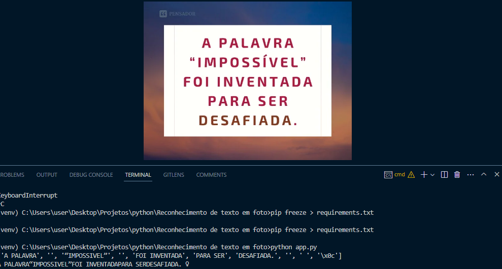

# Reconhecimento-de-caracteres-em-fotos

Esse script extrai texto de fotos e armazena em uma lista

## Tecnologias utilizadas

<ul>
  <li>Python</li>
  <li>Pytesseract</li>
</ul>

## Para instalar o pytesseract entre no ambiente virtual e digite:

```
pip install pytesseract
```

## Observação

<p>É necessário instalar o executavel tesseract, e importar o arquivo exe na onde foi instalado</p>
<p>https://tesseract-ocr.github.io/tessdoc/Downloads.html</p>

## Screenshot


